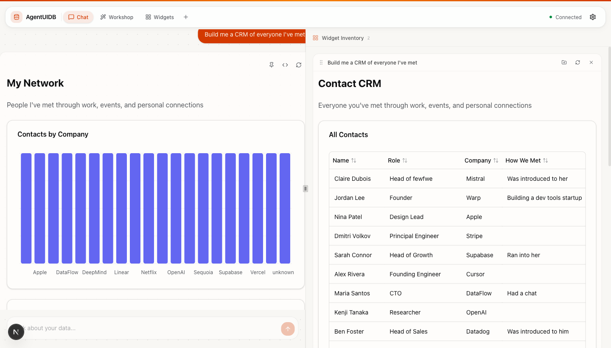
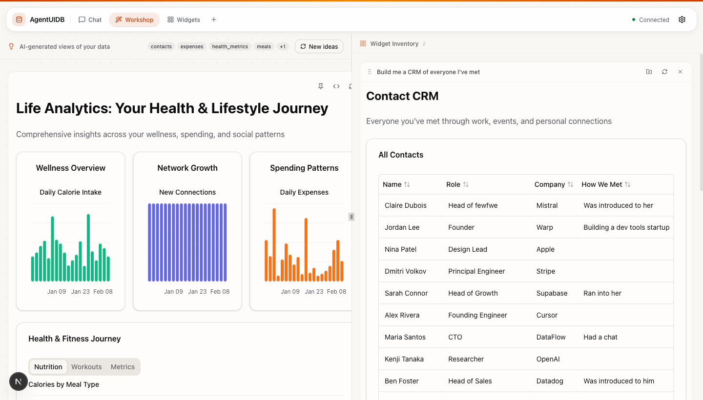
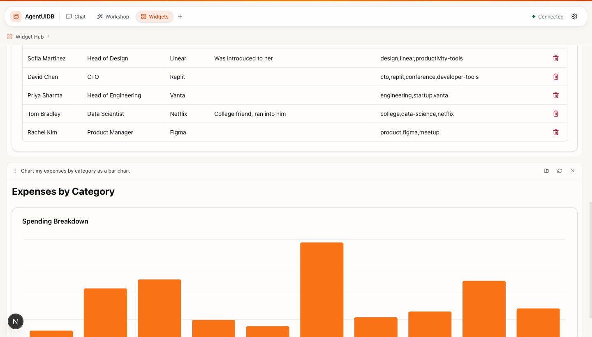

<div align="center">

# AgentUIDB

**Talk naturally. Get structured data and dashboards — automatically.**

Every conversation becomes queryable, visual, and persistent.


</div>

## Features

- **Chat to dashboard** — Ask a question in plain English, get tables, charts, and full dashboards back
- **Auto-structuring** — The AI extracts contacts, expenses, meals, workouts, and more from casual conversation
- **Workshop mode** — Auto-generates multi-tab analytics dashboards from your data, no prompts needed
- **Widget Hub** — Pin, reorder, and curate your favorite visualizations into a persistent dashboard
- **Inline editing** — Edit data directly in tables, delete rows, save changes back to the database
- **MCP server** — Works with Claude Desktop and any MCP-compatible client

## See It In Action

<table>
<tr>
<td width="50%">
<strong>Ask anything, get instant views</strong><br>
<em>"Build me a CRM of everyone I've met"</em>
<br><br>

</td>
<td width="50%">
<strong>Auto-generated analytics</strong><br>
<em>Workshop builds dashboards for you</em>
<br><br>

</td>
</tr>
<tr>
<td width="50%">
<strong>Visualize anything with a sentence</strong><br>
<em>"Chart my expenses by category"</em>
<br><br>

</td>
<td width="50%">
<strong>Pin and collect your favorites</strong><br>
<em>Build a personal dashboard over time</em>
<br><br>

</td>
</tr>
</table>

## How It Works

You talk naturally. The AI extracts structured data and stores it automatically.

> **"Met Rachel Kim at the product meetup, she's a PM at Figma"** → `contacts`
>
> **"Spent $85 on groceries at Trader Joe's"** → `expenses`
>
> **"Morning run, 5k in 24 minutes"** → `workouts`

Then ask for any view: *"Show me everyone I met last month"*, *"Chart my spending by category"*, *"Build me a fitness dashboard"* — and it renders instantly.

## Quick Start

### Prerequisites

- [Node.js](https://nodejs.org/) (v18+)

### Install & Build

```bash
npm install                  # installs all workspace packages
npm run build                # compiles core + MCP server
```

### Add to Claude Code

```bash
claude mcp add agentuidb -- node /path/to/agentuidb/mcp/dist/index.js
claude config add allowedTools 'mcp__agentuidb__*'
```

### Web Dashboard

```bash
cd dashboard && npm run dev
```

Opens at [http://localhost:3000](http://localhost:3000).

Data is stored in `~/.config/agentuidb/agentuidb.sqlite` (auto-created on first use). Override with `AGENTUIDB_DATA_DIR`.

### Seed Data

To try AgentUIDB with sample data, copy the included seed database:

```bash
cp docs/seed.sqlite ~/.config/agentuidb/agentuidb.sqlite
```

This gives you 140 entries across 7 collections (meals, contacts, expenses, workouts, health metrics, travel, meetings) — ready to query and visualize.

To generate fresh seed data using an LLM (requires an [OpenRouter](https://openrouter.ai/) API key):

```bash
OPENROUTER_API_KEY=sk-or-... AGENTUIDB_URL=http://127.0.0.1:8000 npm run seed
```

This sends 140 realistic messages through a chat agent that extracts and stores structured data via the MCP server. All 7 categories run concurrently.

## MCP Server

Works with Claude Desktop and any MCP client.

**stdio** (for Claude Desktop / Claude Code):
```bash
node mcp/dist/index.js
```

### Test

```bash
echo '{"jsonrpc":"2.0","id":1,"method":"initialize","params":{"protocolVersion":"2024-11-05","capabilities":{},"clientInfo":{"name":"test","version":"0.1.0"}}}' | node mcp/dist/index.js
```

## Project Structure

```
├── core/               # Shared library (@agentuidb/core)
│   └── src/            # DB access, query builder, types, handlers
├── mcp/                # MCP server (stdio transport)
│   └── src/            # Thin adapter over core
├── dashboard/          # Web dashboard (Next.js, React)
│   └── src/            # UI, hooks, API routes
├── plugin/             # OpenClaw plugin adapter
├── scripts/            # CLI tools (seed, watch)
├── docs/seed.sqlite    # Pre-built seed database (140 entries)
└── package.json        # npm workspaces root
```

## Built With

[Next.js](https://nextjs.org/) · [SQLite](https://sqlite.org/) · [better-sqlite3](https://github.com/WiseLibs/better-sqlite3) · [MCP](https://modelcontextprotocol.io/) · [Recharts](https://recharts.org/) · [Tailwind CSS](https://tailwindcss.com/) · [shadcn/ui](https://ui.shadcn.com/)
