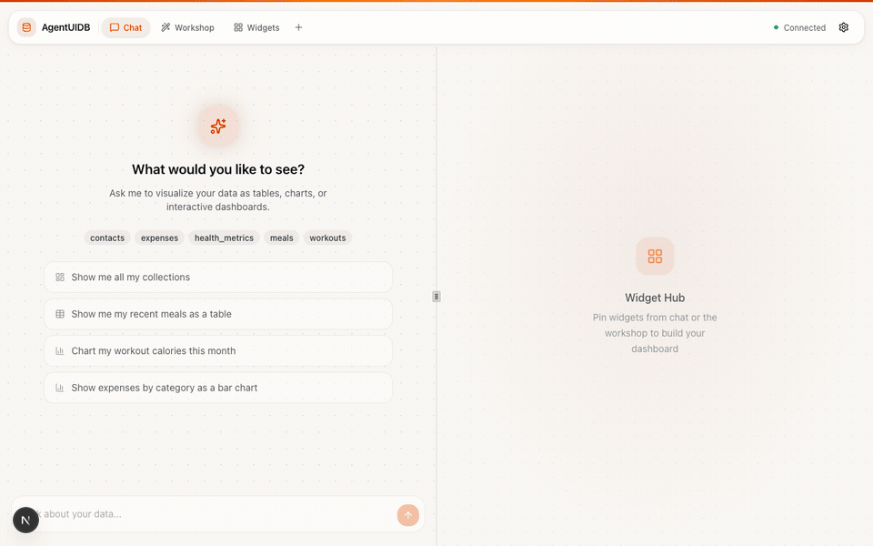

<div align="center">

# AgentUIDB

[](LICENSE)
[](docker-compose.yml)
[](https://modelcontextprotocol.io/)
[](https://surrealdb.com/)

**Talk naturally. Get structured data and dashboards — automatically.**

Every conversation becomes queryable, visual, and persistent.




</div>

## Features

- **Chat to dashboard** — Ask a question in plain English, get tables, charts, and full dashboards back
- **Auto-structuring** — The AI extracts contacts, expenses, meals, workouts, and more from casual conversation
- **Workshop mode** — Auto-generates multi-tab analytics dashboards from your data, no prompts needed
- **Widget Hub** — Pin, reorder, and curate your favorite visualizations into a persistent dashboard
- **Inline editing** — Edit data directly in tables, delete rows, save changes back to the database
- **MCP server** — Works with Claude Desktop and any MCP-compatible client

## See It In Action

<table>
<tr>
<td width="50%">
<strong>Ask anything, get instant views</strong><br>
<em>"Build me a CRM of everyone I've met"</em>
<br><br>

</td>
<td width="50%">
<strong>Auto-generated analytics</strong><br>
<em>Workshop builds dashboards for you</em>
<br><br>

</td>
</tr>
<tr>
<td width="50%">
<strong>Visualize anything with a sentence</strong><br>
<em>"Chart my expenses by category"</em>
<br><br>

</td>
<td width="50%">
<strong>Pin and collect your favorites</strong><br>
<em>Build a personal dashboard over time</em>
<br><br>

</td>
</tr>
</table>

## How It Works

You talk naturally. The AI extracts structured data and stores it automatically.

> **"Met Rachel Kim at the product meetup, she's a PM at Figma"** → `contacts`
>
> **"Spent $85 on groceries at Trader Joe's"** → `expenses`
>
> **"Morning run, 5k in 24 minutes"** → `workouts`

Then ask for any view: *"Show me everyone I met last month"*, *"Chart my spending by category"*, *"Build me a fitness dashboard"* — and it renders instantly.

## Quick Start

Requires [Docker](https://www.docker.com/get-started).

```bash
docker compose build         # build images
docker compose up -d         # starts DB, MCP server, and Dashboard
npm run docker:seed          # load sample data (optional)
```

Open [http://localhost:3000](http://localhost:3000). That's it.

| Service   | URL                     | Description                     |
|-----------|-------------------------|---------------------------------|
| Dashboard | http://localhost:3000   | Next.js web UI with AI chat     |
| MCP       | http://localhost:3001   | MCP server (Streamable HTTP)    |
| SurrealDB | http://localhost:8000   | Database                        |

## MCP Server

Works with Claude Desktop and any MCP client. Two transports:

**stdio** (for Claude Desktop):
```bash
node mcp/dist/index.js
```

**HTTP** (for network access):
```bash
node mcp/dist/http.js       # port 3001, endpoint: POST /mcp
```

<details>
<summary><strong>Local Development</strong></summary>

### Prerequisites

- [Node.js](https://nodejs.org/) (v18+)
- [SurrealDB](https://surrealdb.com/) CLI (`brew install surrealdb/tap/surreal`)

### Install

```bash
npm install                  # root deps (scripts)
cd mcp && npm install        # MCP server deps
cd ../dashboard && npm install  # dashboard deps
```

### Build

```bash
npm run build                # compiles the MCP server
```

### Running the Database

```bash
npm run db                   # start SurrealDB on http://127.0.0.1:8000
npm run db:demo              # start + auto-load sample data
```

Data persists to `.surreal/` (gitignored).

### Web Dashboard

```bash
cd dashboard && npm run dev
```

Opens at [http://localhost:3000](http://localhost:3000).

### Seed Data

```bash
npm run db:load              # import static snapshot (fast, no API key needed)
npm run seed                 # generate fresh data via AI (needs OPENROUTER_API_KEY)
```

### Chat Mode

Interactive CLI where the AI stores structured data from your messages:

```bash
OPENROUTER_API_KEY=sk-or-... AGENTUIDB_URL=http://127.0.0.1:8000 npm run chat
```

### Running Tests

```bash
npm run build && npm run test
```

</details>

## Project Structure

```
├── mcp/                 # MCP server (TypeScript, Node.js)
│   ├── src/
│   ├── Dockerfile
│   └── package.json
├── dashboard/           # Web dashboard (Next.js, React)
│   ├── src/
│   ├── Dockerfile
│   └── package.json
├── scripts/             # CLI tools (chat, seed, test, watch)
├── docker-compose.yml   # Run everything with Docker
└── package.json         # Root scripts
```

## Built With

[Next.js](https://nextjs.org/) · [SurrealDB](https://surrealdb.com/) · [MCP](https://modelcontextprotocol.io/) · [Recharts](https://recharts.org/) · [Tailwind CSS](https://tailwindcss.com/) · [shadcn/ui](https://ui.shadcn.com/)
