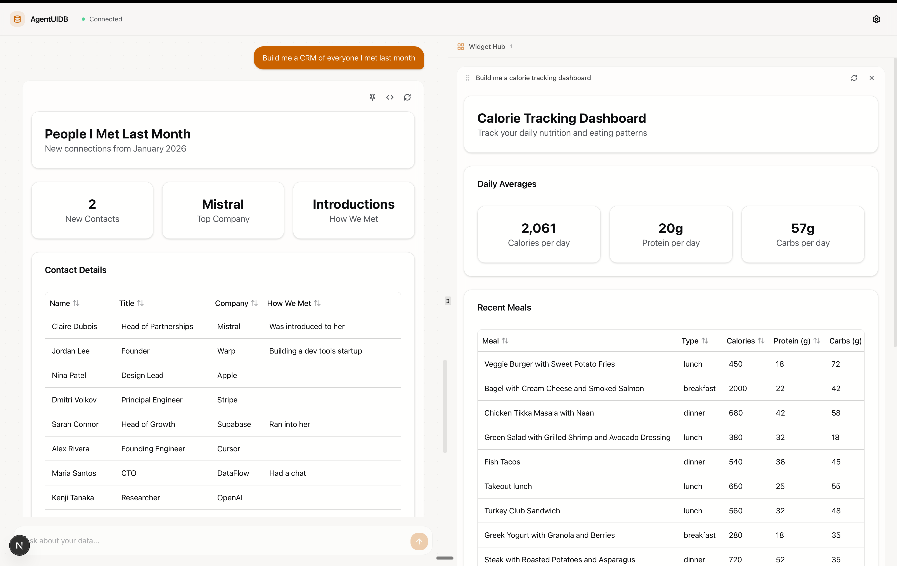

# AgentUIDB

Talk to an AI. It remembers everything — structured, queryable, automatic.



# How It Works

## Background Storage

You talk naturally. The agent extracts structured data and stores it automatically.

> **You say:** "Had sushi for dinner — salmon roll and tuna nigiri"

```json
// → meals
{
  "meal_name": "Sushi",
  "calories": 450,
  "meal_type": "dinner",
  "tags": ["japanese"]
}
```

> **You say:** "Met Rachel Kim at the product meetup, she's a PM at Figma"

```json
// → contacts
{
  "name": "Rachel Kim",
  "role": "PM",
  "company": "Figma",
  "context": "product meetup"
}
```

> **You say:** "Spent $85 on groceries at Trader Joe's"

```json
// → expenses
{
  "amount": 85,
  "category": "groceries",
  "vendor": "Trader Joe's"
}
```

# Quick Start (Docker)

The fastest way to get everything running. Requires [Docker](https://www.docker.com/get-started).

```bash
docker compose up -d        # starts DB, MCP server, and Dashboard
npm run docker:seed          # load sample data (optional)
```

Open [http://localhost:3000](http://localhost:3000) for the dashboard.

That's it. Three services running:

| Service   | URL                     | Description                     |
|-----------|-------------------------|---------------------------------|
| Dashboard | http://localhost:3000   | Next.js web UI with AI chat     |
| MCP       | http://localhost:3001   | MCP server (Streamable HTTP)    |
| SurrealDB | http://localhost:8000   | Database                        |

### Port Conflicts

If the default ports are in use, override them:

```bash
DB_PORT=8800 MCP_PORT=3800 DASHBOARD_PORT=3900 docker compose up -d
```

### Docker Commands

```bash
docker compose up -d         # start all services
docker compose down          # stop all services
docker compose down -v       # stop and delete data
docker compose logs -f       # tail logs
docker compose build         # rebuild images
npm run docker:seed          # load sample data into DB
```

# Local Development

For developing without Docker.

## Prerequisites

- [Node.js](https://nodejs.org/) (v18+)
- [SurrealDB](https://surrealdb.com/) CLI (`brew install surrealdb/tap/surreal`)

## Install

```bash
npm install                  # root deps (scripts)
cd mcp && npm install        # MCP server deps
cd ../dashboard && npm install  # dashboard deps
```

## Build

```bash
npm run build                # compiles the MCP server
```

## Running the Database

```bash
npm run db                   # start SurrealDB on http://127.0.0.1:8000
npm run db:demo              # start + auto-load sample data
```

Data persists to `.surreal/` (gitignored).

## Web Dashboard

```bash
cd dashboard && npm run dev
```

Opens at [http://localhost:3000](http://localhost:3000).

## Seed Data

Two ways to populate the database:

```bash
npm run db:load              # import static snapshot (fast, no API key needed)
npm run seed                 # generate fresh data via AI (needs OPENROUTER_API_KEY)
```

## Chat Mode

Interactive CLI where the AI silently stores structured data from your messages:

```bash
OPENROUTER_API_KEY=sk-or-... AGENTUIDB_URL=http://127.0.0.1:8000 npm run chat
```

Commands: `dump` (show stored data), `quit` (exit).

## Terminal Dashboard

Live-refreshing terminal UI showing all collections and recent documents:

```bash
npm run watch
```

## Running Tests

```bash
npm run build && npm run test
```

## MCP Server

The server supports two transports:

**stdio** (for MCP clients like Claude Desktop):
```bash
node mcp/dist/index.js
```

**HTTP** (for network access, used in Docker):
```bash
node mcp/dist/http.js       # listens on port 3001, endpoint: POST /mcp
```

Set `AGENTUIDB_URL` to tell it where SurrealDB is running.

# Project Structure

```
├── mcp/                 # MCP server (TypeScript, Node.js)
│   ├── src/
│   ├── Dockerfile
│   └── package.json
├── dashboard/           # Web dashboard (Next.js, React)
│   ├── src/
│   ├── Dockerfile
│   └── package.json
├── scripts/             # CLI tools (chat, seed, test, watch)
├── docker-compose.yml   # Run everything with Docker
└── package.json         # Root scripts
```
